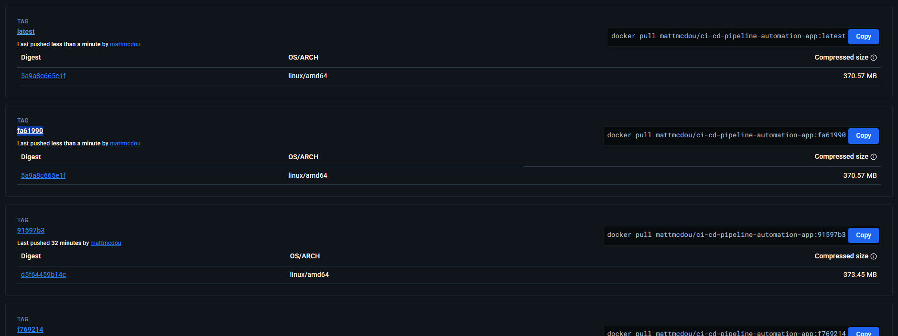

# CI-CD-Pipeline-Automation

ENSF 400 - Course Project
Winter Semester 2025

Team members:

- Sachin Seizer
- Matthew McDougall
- Brendan Smiley
- Luca Rios

## Project Initialization

1. Clone the repository

2. Use Java JDK 11

3. Ensure gretty is 3.1.5 not 3.0.4
4. Follow the remainder of the instructions in the README.md

## GitHub Repository & Git Workflow (15%)

For our github workflow, we created rules to ensure branch protections. Those rules include not allowing collaborators to commit changes directly to main and requiring a reviewer for each pull request. The typical workflow is below:

1. Create a new branch from main
2. Make changes to the code
3. Push the changes to the branch
4. Create a pull request
5. Assign a reviewer
6. Review the changes
7. Merge the pull request (Blocked until reviewer approves)
8. Delete the branch (Maybe depends on the branch)

### Pull Request from @SuperSachinS

Below shows an example of how our team is using github and git to collaborate in a effective manner.


## Containerization (20%)

### Background/Development/Usage

Below is the process taken to containerize the application:

1. Created a Dockerfile
2. Built the Docker image using `docker build --tag 'ensf400-g20' .`
3. Run the Docker image using `docker run -it -p 8080:8080 ensf400-g20`
4. An alternative way to run the Dockerfile: Run `docker compose up` to start the application and keep it running.
5. Access the application at `http://localhost:8080/demo`

### Dockerfile

The Dockerfile can be found [here](./Dockerfile)
As seen in the Dockerfile, we had to use the same versioning requirements that were needed to run the application locally. This meant using an exact gradle image with the correct version of gradle and java JDK. Afterwards the Dockerfile copies the project directory into the container and then runs the application using gradle instead of the gradle wrapper provided in the project.

### Docker Compose

The Docker Compose file can be found [here](./docker-compose.yml), this helps ensure that the containerization procedure will scale moving forward with the project. Additionally, we used the docker-compose.yml to ensure that the application did not immediately exit after starting up.

### Docker Image on Docker Hub

Our docker image can be found in a repository on docker hub [here](https://hub.docker.com/repository/docker/mattmcdou/ci-cd-pipeline-automation-app/tags/latest/sha256-cedc83a81df4c45f3a1312ecd1c3a48de0c5cf1e51c645d8446d645863fcfaca).

use the following command to pull the image:

```bash
docker pull mattmcdou/ci-cd-pipeline-automation-app:latest
```

use the following command to run the container, and keep it open:

```bash
docker run -it -p 8080:8080 mattmcdou/ci-cd-pipeline-automation-app:latest
```

### Automated Image Version Tagging and Publishing

GitHub Actions was used to automate the process of version tagging and publishing the Docker image to Docker Hub. The workflow can be found [here](./.github/workflows/docker-image.yml). The workflow is triggered on every push to the master (default) branch. The workflow builds the Docker image, tags it with the latest version, and then pushes it to Docker Hub. The following screenshot shows the final results of a new version on Docker Hub, **with the latest tag being the commit SHA id**.

Commit SHA:

The commit SHA is fa61990


Automated Image Tagging Commit Versions:

The SHA of fa61990 is the latest tag id for the image on Docker Hub.



## CI/CD Pipeline Automation (40%)

❗ TODO ❗

## Testing & Code Quality (10%)

❗ TODO ❗

## Documentation & Demo (15%)

❗ TODO ❗
